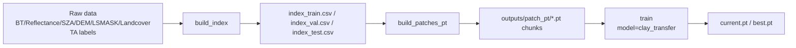
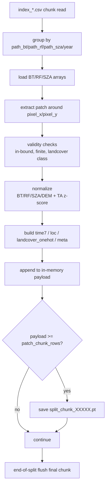
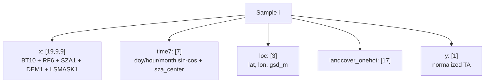

# TA_2D_VER1

GK-2A 2D 패치 기반 TA 회귀 학습 파이프라인입니다.  
현재 단계는 **Clay pretrained encoder를 이용한 supervised fine-tuning**입니다.


## Quick Summary

| 항목 | 현재 상태 |
| --- | --- |
| 학습 방식 | Clay encoder + TA supervised fine-tuning |
| 데이터 포맷 | `patch_pt` (`*_chunk_XXXXX.pt`) |
| 입력 | `x(19,9,9) + time7 + loc + landcover_onehot` |
| 타깃 | TA z-score |
| 체크포인트 | `current.pt`(latest), `best.pt`(best val) |
| 메트릭 | `loss(MSE)`, `RMSE(norm)`, `RMSE(K)` |

## 현재 구현 상태

- `build_index`: 라벨/위성 매칭 인덱스 생성 (`train/val/test` 분할 CSV)
- `build_patches_pt`: 학습용 패치를 `.pt` chunk로 생성
- `train`:
  - `data_source: patch_pt` 기준 학습
  - `model.type: clay_transfer` 지원
  - AMP/TF32 지원
  - epoch마다 `current.pt` 저장, 성능 개선 시 `best.pt` 저장
  - loss + RMSE(norm/K) 출력

아직 미구현:
- Clay 원형 MAE 재구성 학습
- DINOv2 self-distillation loss

## 디렉토리

```text
TA_2D_VER1/
  main.py
  configs/
    data_2d.yaml
    train_ta.yaml
  src/
    data/
      build_index.py
      build_patches_pt.py
      check_patch_pt.py
      dataset.py
      transforms.py
      validators.py
      weight/clay-v1.5.ckpt
    models/
      clay_transfer.py
      clay_ta_head.py
      losses.py
    train/
      trainer.py
      loops.py
      checkpoint.py
      benchmark_dataloader.py
    utils/
      io.py
      time_features.py
  outputs/
    index/
    patch_pt/
    checkpoints/
    logs/
```

## 실행 순서

```bash
python main.py --config configs/data_2d.yaml --stage build_index
python main.py --config configs/data_2d.yaml --stage build_patches_pt
python main.py --config configs/train_ta.yaml --stage train
```



참고:
- `build_index` 결과:
  - `outputs/index/index.csv`
  - `outputs/index/index_train.csv`
  - `outputs/index/index_val.csv`
  - `outputs/index/index_test.csv`
- 현재 기본 학습 경로는 `patch_pt`입니다.

## PT 청크 생성 상세 (`build_patches_pt`)

`build_patches_pt`는 `index_train/val/test.csv`를 읽어 학습용 `.pt` chunk를 생성합니다.



### 1) 입력/출력

- 입력:
  - `outputs/index/index_train.csv`
  - `outputs/index/index_val.csv`
  - `outputs/index/index_test.csv`
- 출력:
  - `outputs/patch_pt/train_chunk_00000.pt`, ...
  - `outputs/patch_pt/val_chunk_00000.pt`, ...
  - `outputs/patch_pt/test_chunk_00000.pt`, ...

### 2) 샘플 생성 흐름

1. 인덱스 CSV를 `patch_chunk_rows` 단위로 chunk 읽기
2. `(path_bt, path_reflectance, path_sza, year)` 기준 그룹 처리
3. 중심 픽셀 기준으로 `patch_size x patch_size` 패치 추출
4. 유효성 필터:
   - 경계 밖 좌표 제외
   - NaN/Inf 포함 샘플 제외
   - landcover 클래스 범위 밖 제외
5. 정규화:
   - BT/Reflectance/SZA/DEM: `input_statistics_2022.json` 기준 z-score
   - TA: `statistics_2022.json` 기준 z-score
6. 부가 피처 생성:
   - `time7`: `[doy_cos, doy_sin, hour_cos, hour_sin, month_cos, month_sin, sza_center]`
   - `loc`: `[lat, lon, gsd_m]`
   - `landcover_onehot`: 17차원
7. 메모리 버퍼에 누적 후 `patch_chunk_rows`개마다 `.pt` 저장

### 3) PT 파일 내부 구조

각 `*_chunk_XXXXX.pt`는 아래 키를 가집니다.

- `x`: `(N, 19, 9, 9)` float32
- `y`: `(N,)` float32 (정규화된 TA)
- `time7`: `(N, 7)` float32
- `loc`: `(N, 3)` float32
- `landcover_onehot`: `(N, 17)` float32
- `meta`: 길이 `N` list (timestamp/stn/pixel 좌표)

여기서 `N`은 보통 `patch_chunk_rows`이며 마지막 파일은 더 작을 수 있습니다.

### 4) 재시작/이어쓰기

- `build.skip_existing_patch_pt: true`이면 기존 chunk를 감지해 이어서 생성합니다.
- 기존 파일의 샘플 수를 읽어 `resume_rows` 기준으로 스킵 후 이어 생성합니다.

### 5) 성능 관련 설정 (`configs/data_2d.yaml`)

- `build.patch_chunk_rows`: 파일당 샘플 수 (예: 100000)
- `build.split_workers`: split(train/val/test) 병렬 처리 수
- `build.skip_existing_patch_pt`: 기존 chunk 있으면 이어쓰기/스킵

실무 팁:
- 너무 큰 `patch_chunk_rows`는 파일 I/O 단위가 커져 랜덤 접근이 느려질 수 있습니다.
- 너무 작은 값은 파일 수가 과도하게 늘어 관리/오버헤드가 증가합니다.

## 입력/타깃 스펙

- `x`: `(19, 9, 9)` float32
  - BT 10 + Reflectance 6 + SZA 1 + DEM 1 + LSMASK 1
- `time7`: `[doy_cos, doy_sin, hour_cos, hour_sin, month_cos, month_sin, sza_center]`
- `loc`: `[lat, lon, gsd_m]` (현재 gsd 2000m)
- `landcover_onehot`: 17차원
- `y`: TA z-score 정규화 값



정규화 통계:
- `data/statistics/input_statistics_2022.json`
- `data/statistics/statistics_2022.json`

## Clay 전이학습 설정

`configs/train_ta.yaml`:

- `model.type: clay_transfer`
- `model.clay_ckpt_path`: Clay 체크포인트 경로
- `model.bt_waves_um`, `model.rf_waves_um`: 파장 메타
- `model.freeze_encoder: true` (기본)

현재 학습은 TA supervised MSE 기반이며, Clay encoder를 feature extractor로 사용합니다.

## 체크포인트

저장 위치: `outputs/checkpoints`

- `current.pt`: 최신 epoch 상태
- `best.pt`: 검증 loss 최고 성능 상태

각 파일에는 `model/optimizer/scheduler/epoch/best_val`이 함께 저장됩니다.

## 로그/메트릭

학습 로그에서 epoch마다 아래를 출력합니다.

- `train_loss`, `val_loss` (MSE)
- `train_rmse_norm`, `val_rmse_norm`
- `train_rmse_K`, `val_rmse_K`

`RMSE_K = RMSE_norm * TA_std`를 사용합니다.

## 유틸리티

패치 파일 빠른 확인:

```bash
python src/data/check_patch_pt.py
```

옵션:
- `python src/data/check_patch_pt.py path/to/file.pt --idx 10`

## Q&A (현재 구현 기준)

### Q1. 지금 Clay를 "그대로" 구현한 상태인가?

아니요. 현재는 **Clay encoder 기반 TA fine-tuning**입니다.

- 구현됨: pretrained ckpt 사용, waves 입력, time/loc/gsd 입력, supervised TA 회귀
- 미구현: MAE 재구성 loss, DINOv2 self-distillation loss

### Q2. time/lat-lon/gsd/wavelength는 실제로 모델에 들어가나?

들어갑니다. (현재 코드에 구현됨)

- `time7`에서 Clay 입력으로 필요한 time/latlon 조합 사용
- `loc`의 `lat/lon/gsd` 사용 (`gsd_m=2000.0`)
- 파장은 `train_ta.yaml`의 `model.bt_waves_um`, `model.rf_waves_um` 사용

정리:
- 시간 인코딩: 구현됨
- GSD 인코딩: 구현됨
- 채널 중심 파장 전달: 구현됨

### Q3. tqdm에 loss와 rmse는 어떻게 표시되는가?

- `loss`: MSE
- `rmse`: `sqrt(MSE)`
- `rmse_K`: 정규화 해제 RMSE (`RMSE_norm * TA_std`)

### Q4. 체크포인트는 어떻게 저장되나?

- `current.pt`: 매 epoch 최신 상태
- `best.pt`: val loss 개선 시 갱신

둘 다 `model/optimizer/scheduler/epoch/best_val` 포함.

### Q5. 왜 학습 중간중간 끊기는가?

주요 원인은 `patch_pt` 대용량 파일의 `torch.load`/I/O 병목입니다.  
현재는 파일 접근 패턴을 단순화(`shuffle_files/within_file` 제어)하고, worker/pin_memory로 완화 중입니다.

### Q5-1. "마스킹(MAE) 학습"을 지금 쓰고 있나?

아니요. 현재 학습은 MAE 마스킹 재구성 학습이 아니라 **TA supervised fine-tuning**입니다.  
따라서 "지점 TA인데 마스킹이 가능한가?" 이슈는 현재 학습 루프에는 직접 적용되지 않습니다.

### Q6. shuffle은 어떻게 쓰는 게 맞나?

속도 우선이면:

- `patch_shuffle_files: false`
- `patch_shuffle_within_file: false`

일반화 우선이면 두 옵션을 `true`로 올릴 수 있지만 I/O 부담이 증가합니다.

### Q7. 왜 GPU 메모리가 생각보다 적게 쓰이나?

현재 기본이 `freeze_encoder: true`라 인코더의 역전파 activation 저장이 작습니다.  
또 입력 패치가 `9x9`라 batch 증가 대비 메모리 증가폭이 제한적입니다.

### Q8. freeze_encoder를 지금 풀어야 하나?

현재 단계에서는 권장하지 않습니다.

1. 먼저 `freeze_encoder=true`로 안정 수렴
2. 필요 시 후반에 `freeze_encoder=false` + 낮은 LR로 짧게 미세조정

### Q9. validation이 train보다 느려 보이는 이유는?

체감상 `val` 직후 체크포인트 저장 I/O가 붙어서 느려 보일 수 있습니다.  
순수 배치 수 기준으로는 보통 `val`이 더 작으면 더 빨라야 정상입니다.


## 기존 고민 Q&A (업데이트 답변)

### Q. 현재는 파일 매칭용 timestamp만 있고, 모델 입력 피처(sin/cos of day-of-year, minute-of-day)로는 아직 완전히 구현되지 않았습니다?

A. 현재는 구현되어 있습니다.  
`time7 = [doy_cos, doy_sin, hour_cos, hour_sin, month_cos, month_sin, sza_center]`를 입력으로 사용합니다.

### Q. GSD 인코딩은 아직 입력에 포함되지 않았습니다?

A. 현재는 포함되어 있습니다.  
`loc = [lat, lon, gsd_m]`로 입력되며, 기본 `gsd_m=2000.0`(2km)입니다.

### Q. 각 채널의 중심 파장 전달 로직이 없습니다?

A. 현재는 포함되어 있습니다.  
`model.bt_waves_um`(10채널) + `model.rf_waves_um`(6채널)을 Clay encoder 입력으로 사용합니다.

### Q. 마스킹을 해도 괜찮은가요? TA가 지점자료인데...

A. 현재 학습 루프에서는 마스킹(MAE)을 사용하지 않습니다.  
지금 단계는 MAE가 아닌 **TA supervised fine-tuning**입니다.

### Q. Self-Distillation(DINOv2)은 현재 학습에 들어가나요?

A. 현재 학습에는 들어가지 않습니다.  
현재는 회귀 loss(MSE/RMSE) 기반 fine-tuning만 수행합니다.

### Q. 샘플은 CSV로 저장하나요, NPY/PT로 저장하나요?

A. 현재 기본 경로는 다음과 같습니다.

- 인덱스: CSV (`outputs/index/index_*.csv`)
- 학습 데이터: PT chunk (`outputs/patch_pt/*_chunk_*.pt`)

### Q. Landcover one-hot은 어떻게 처리하나요?

A. 패치 중심 픽셀 기준 클래스 값을 one-hot(17차원)으로 사용합니다.

### Q. 결측 데이터는 어떻게 처리하나요?

A. `build_patches_pt` 단계에서 NaN/Inf/유효범위 조건을 통과한 샘플만 저장합니다.

### Q. 정규화는 어떻게 하나요?

A. 2022 통계를 사용한 z-score 정규화입니다.

- 입력 통계: `data/statistics/input_statistics_2022.json`
- 타깃 통계: `data/statistics/statistics_2022.json`
