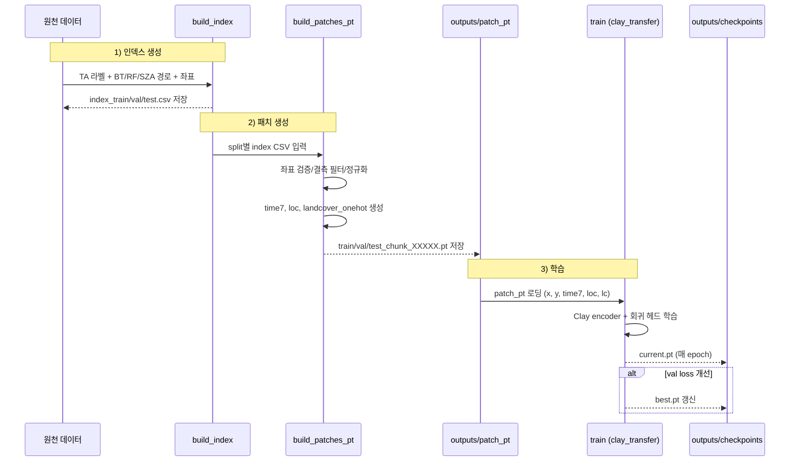
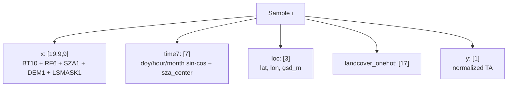

# TA_2D_VER1

<div align="center">

GK-2A 2D 패치 기반 TA 회귀 학습 파이프라인  
**Clay 사전학습 인코더 기반 전이학습**


</div>

---

## 한눈에 보기

| 항목 | 현재 상태 |
| --- | --- |
| 학습 방식 | Clay encoder transfer fine-tuning |
| 데이터 포맷 | `patch_pt` (`*_chunk_XXXXX.pt`) |
| 입력 | `x(19,9,9) + time7 + loc + landcover_onehot` |
| 타깃 | TA z-score |
| 체크포인트 | `current.pt`(최신), `best.pt`(최저 val loss) |
| 메트릭 | `loss(MSE), RMSE(norm), RMSE(K)` |

---

## 파이프라인



### 실행 순서

```bash
python main.py --config configs/data_2d.yaml --stage build_index
python main.py --config configs/data_2d.yaml --stage build_patches_pt
python main.py --config configs/train_ta.yaml --stage train
```

---

## 패치 생성 상세 (`build_patches_pt`)

### 입력/출력

- 입력 인덱스:
  - `outputs/index/index_train.csv`
  - `outputs/index/index_val.csv`
  - `outputs/index/index_test.csv`
- 출력 청크:
  - `outputs/patch_pt/train_chunk_00000.pt` ...
  - `outputs/patch_pt/val_chunk_00000.pt` ...
  - `outputs/patch_pt/test_chunk_00000.pt` ...

### PT 청크 내부 스키마

- `x`: `(N, 19, 9, 9)` float32
- `y`: `(N,)` float32 (정규화된 TA)
- `time7`: `(N, 7)` float32
- `loc`: `(N, 3)` float32
- `landcover_onehot`: `(N, 17)` float32
- `meta`: 길이 `N` list (`timestamp_utc`, `stn`, `pixel_x`, `pixel_y`)

---

## 샘플 텐서 구조



정규화 통계 파일:
- `data/statistics/input_statistics_2022.json`
- `data/statistics/statistics_2022.json`

---

## Clay 전이학습 설정

`configs/train_ta.yaml`

- `model.type: clay_transfer`
- `model.clay_ckpt_path`: Clay 체크포인트 경로
- `model.bt_waves_um`, `model.rf_waves_um`: 파장 메타데이터
- `model.freeze_encoder: true` (기본)

현재 학습 범위:
- 구현됨: supervised TA fine-tuning
- 미구현: MAE reconstruction, DINOv2 self-distillation

---

## 체크포인트 정책

저장 위치: `outputs/checkpoints`

- `current.pt`: 최신 epoch 상태
- `best.pt`: 최저 validation loss 상태

포함 항목:
- `model`, `optimizer`, `scheduler`, `epoch`, `best_val`

---

## 로그/메트릭

epoch 로그 출력:

- `train_loss`, `val_loss` (MSE)
- `train_rmse_norm`, `val_rmse_norm`
- `train_rmse_K`, `val_rmse_K`

`RMSE_K = RMSE_norm * TA_std`

---

## 문서

- Q&A: `docs/FAQ.md`
- 문서 구성 안내: `docs/README.md`

## Utilities

패치 파일 빠른 확인:

```bash
python src/data/check_patch_pt.py
```

특정 파일/인덱스 확인:

```bash
python src/data/check_patch_pt.py outputs/patch_pt/train_chunk_00010.pt --idx 10
```
