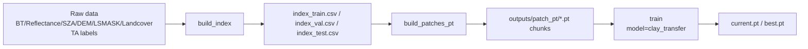
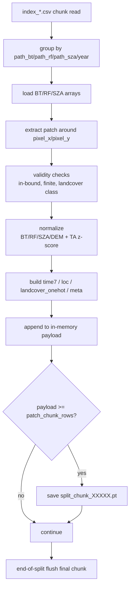
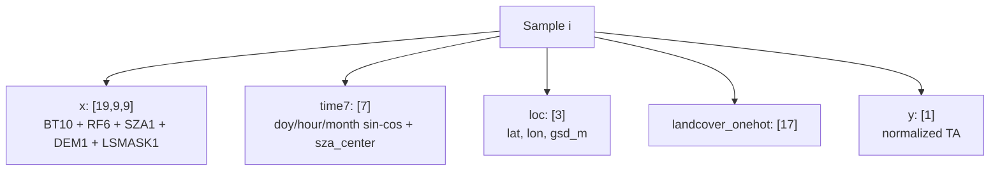

# TA_2D_VER1

<div align="center">

GK-2A 2D 패치 기반 TA 회귀 학습 파이프라인  
**Clay pretrained encoder + supervised fine-tuning**


</div>

---

## At A Glance

| Item | Current |
| --- | --- |
| Training mode | Clay encoder transfer fine-tuning |
| Data format | `patch_pt` (`*_chunk_XXXXX.pt`) |
| Input | `x(19,9,9) + time7 + loc + landcover_onehot` |
| Target | TA z-score |
| Checkpoints | `current.pt` (latest), `best.pt` (best val) |
| Metrics | `loss(MSE), RMSE(norm), RMSE(K)` |

---

## Pipeline



### Run

```bash
python main.py --config configs/data_2d.yaml --stage build_index
python main.py --config configs/data_2d.yaml --stage build_patches_pt
python main.py --config configs/train_ta.yaml --stage train
```

---

## Patch Build Anatomy (`build_patches_pt`)



### Input / Output

- Input index files:
  - `outputs/index/index_train.csv`
  - `outputs/index/index_val.csv`
  - `outputs/index/index_test.csv`
- Output chunk files:
  - `outputs/patch_pt/train_chunk_00000.pt` ...
  - `outputs/patch_pt/val_chunk_00000.pt` ...
  - `outputs/patch_pt/test_chunk_00000.pt` ...

### Chunk payload schema

- `x`: `(N, 19, 9, 9)` float32
- `y`: `(N,)` float32 (normalized TA)
- `time7`: `(N, 7)` float32
- `loc`: `(N, 3)` float32
- `landcover_onehot`: `(N, 17)` float32
- `meta`: length `N` list (`timestamp_utc`, `stn`, `pixel_x`, `pixel_y`)

---

## Sample Tensor Design



Normalization stats:
- `data/statistics/input_statistics_2022.json`
- `data/statistics/statistics_2022.json`

---

## Clay Transfer Settings

`configs/train_ta.yaml`

- `model.type: clay_transfer`
- `model.clay_ckpt_path`: Clay checkpoint path
- `model.bt_waves_um`, `model.rf_waves_um`: wavelength metadata
- `model.freeze_encoder: true` (default)

Current training scope:
- Implemented: supervised TA fine-tuning
- Not implemented: MAE reconstruction, DINOv2 self-distillation

---

## Checkpoint Policy

Saved in `outputs/checkpoints`:

- `current.pt`: latest epoch state
- `best.pt`: best validation loss state

Both contain:
- `model`, `optimizer`, `scheduler`, `epoch`, `best_val`

---

## Logs & Metrics

Per-epoch log outputs:

- `train_loss`, `val_loss` (MSE)
- `train_rmse_norm`, `val_rmse_norm`
- `train_rmse_K`, `val_rmse_K`

`RMSE_K = RMSE_norm * TA_std`

---

## Practical Q&A (Current State)

### Q1. Is this full Clay pretraining?
No. This is Clay encoder transfer learning for TA regression.

### Q2. Are time / lat-lon / gsd / wavelength actually used?
Yes. All are wired into the current training path.

### Q3. Why does tqdm show both loss and rmse?
- `loss`: MSE
- `rmse`: `sqrt(MSE)`

### Q4. Why does training sometimes stall?
Primary cause is large `patch_pt` I/O (`torch.load`) rather than model math.

### Q5. Is MAE masking used now?
No. Current loop is supervised TA fine-tuning only.

---

## Utilities

Inspect a patch chunk quickly:

```bash
python src/data/check_patch_pt.py
```

Inspect specific file/index:

```bash
python src/data/check_patch_pt.py outputs/patch_pt/train_chunk_00010.pt --idx 10
```
